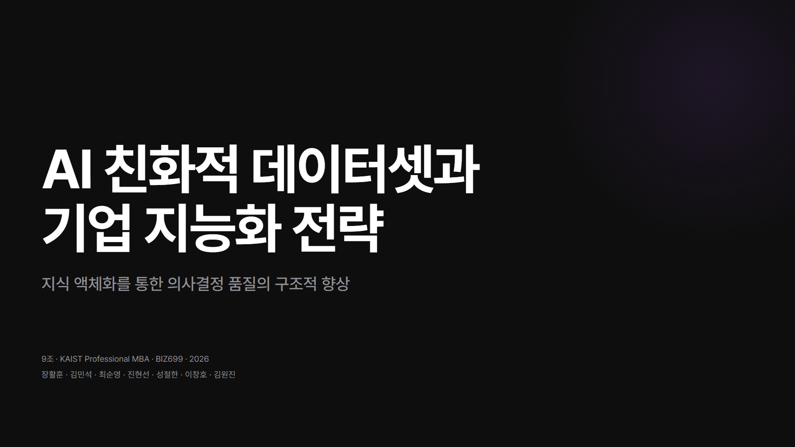
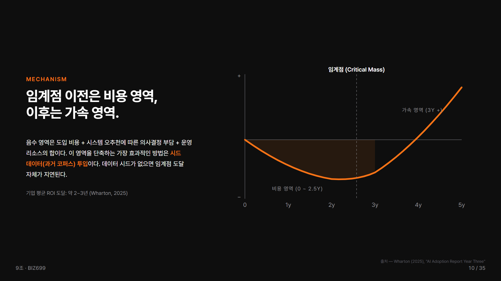
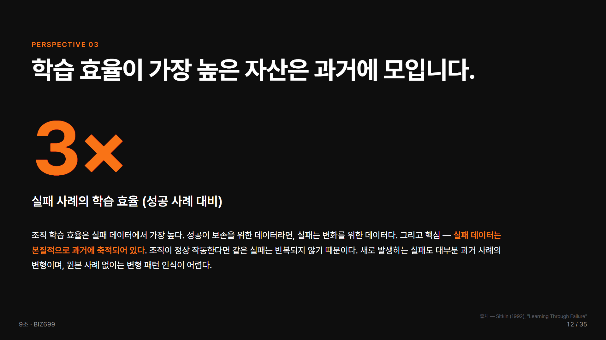
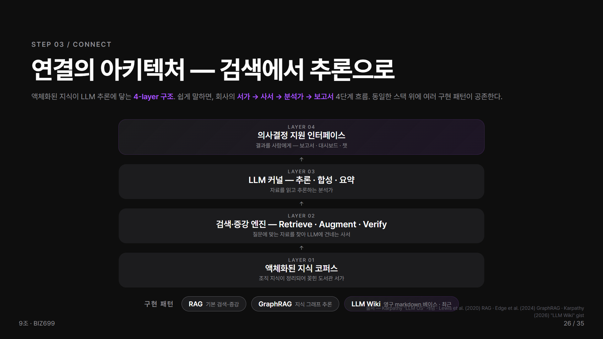
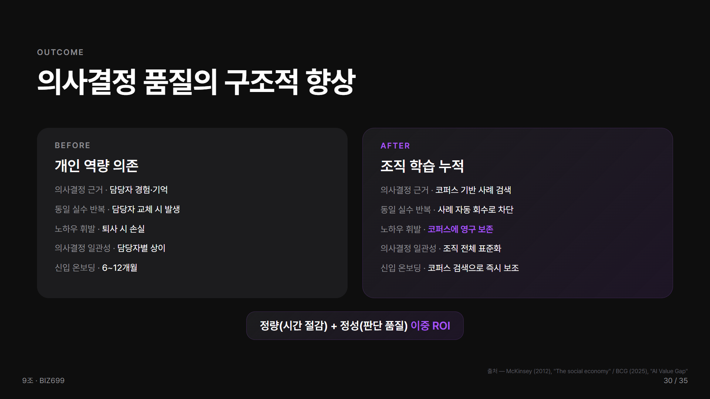
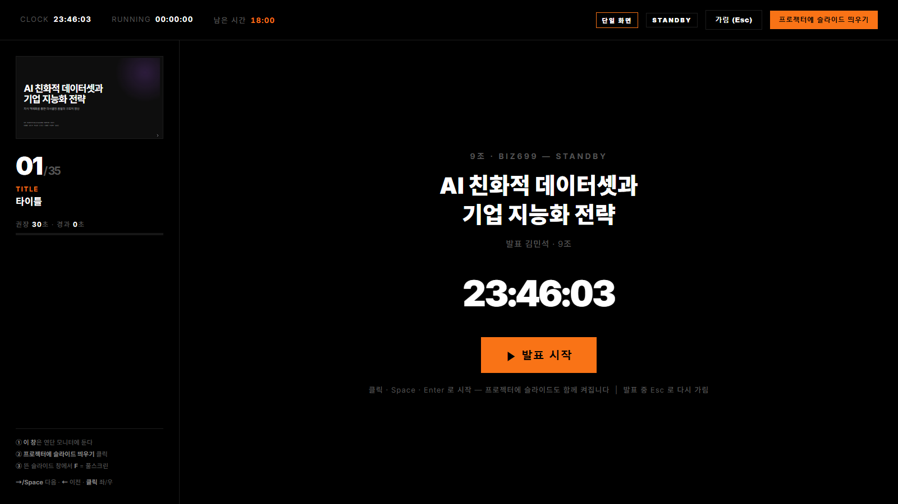
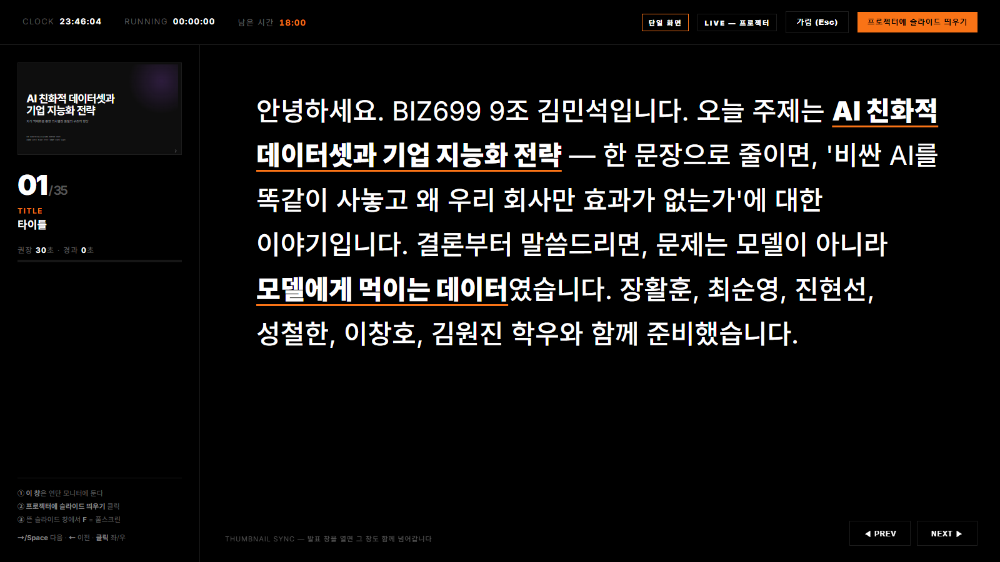
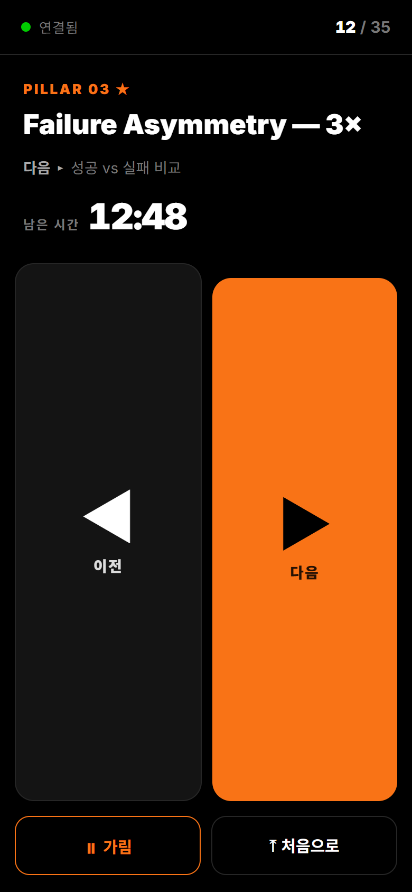
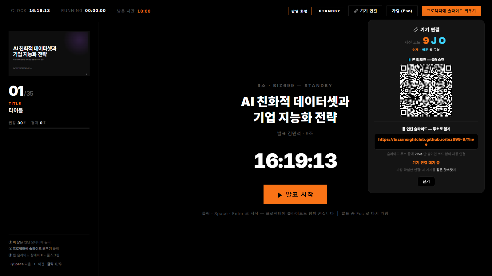

# AI 친화적 데이터셋과 기업 지능화 전략

> **지식 액체화(Knowledge Liquefaction)를 통한 의사결정 품질의 구조적 향상**
> KAIST Professional MBA · BIZ699 · **9조** · 2026
> 다크 모드 · **35 슬라이드** · Reveal.js v5 (정적 HTML/CSS/JS, 빌드 도구 없음)



---

## 🔗 라이브

| | 주소 |
|---|---|
| **발표 슬라이드** | https://bizsinsightclub.github.io/biz699-9/ |
| **발표자 텔레프롬프터** | https://bizsinsightclub.github.io/biz699-9/prompter.html |

> 핵심 명제 — **AI 도입 성과를 결정하는 것은 모델이 아닌, 조직 지식의 구조화 수준이다.**
> 3단계 프레임워크: **진단(Diagnose) → 액체화(Liquefy) → 연결(Connect)**

---

## 🖼 미리보기

<table>
  <tr>
    <td width="50%"><br/><sub><b>Cold Start — J-curve</b> · 임계점 이전은 비용, 이후는 가속</sub></td>
    <td width="50%"><br/><sub><b>Failure Asymmetry</b> · 실패 데이터의 학습 효율 3배</sub></td>
  </tr>
  <tr>
    <td width="50%"><br/><sub><b>연결 아키텍처</b> · 서가 → 사서 → 분석가 → 보고서</sub></td>
    <td width="50%"><br/><sub><b>Before / After</b> · 개인 역량 의존 → 조직 학습 누적</sub></td>
  </tr>
</table>

---

## ▶ 발표 실행 (로컬)

1. `index.html` 을 **Chrome** 또는 **Edge** 로 연다.
2. `F` — 풀스크린 · `→ / ←` — 슬라이드 전환 · `S` — 발표자 노트 창 · `O / ESC` — 개요.

| 키 | 동작 | 키 | 동작 |
|---|---|---|---|
| `→` `Space` `PageDown` | 다음 | `F` | 풀스크린 |
| `←` `PageUp` | 이전 | `S` | 발표자 노트 창 |
| `O` `ESC` | 개요 모드 | `B` `.` | 화면 블랙아웃 |

---

## 🎤 발표자 텔레프롬프터 (`prompter.html`)

발표자 노트북에 띄우는 대형 대본 화면. **슬라이드 썸네일이 라이브로 동기화**되고, **프로젝터에 슬라이드를 자동 배치**하며, 세팅 중엔 **시작 가림막**으로 대본을 가린다.

<table>
  <tr>
    <td width="50%"><br/><sub><b>STANDBY</b> · 시작 전 대본을 가리는 스탠바이 화면</sub></td>
    <td width="50%"><br/><sub><b>LIVE</b> · 대형 대본 + 썸네일 + 페이스 타이머</sub></td>
  </tr>
</table>

**대본 글자 크기** — 하단 **`A−` / `A+`** 버튼 또는 키보드 **`+` / `-`** 로 조절(24~88px). 설정은 브라우저에 저장돼 다음에도 유지. 연단 모니터 각도가 낮거나 멀 때 크게.

**강연장 듀얼 스크린 — 30초 세팅**
1. `Win` + `P` → **확장(Extend)** (프롬프터 헤더가 `확장 ✓` 녹색이면 정상)
2. **연단 모니터**에서 `prompter.html` 열기 (대본은 자동으로 가려진 스탠바이 상태)
3. 헤더 **`프로젝터에 슬라이드 띄우기`** → 슬라이드가 프로젝터 화면 전체에 자동 배치
4. 발표 직전 **`▶ 발표 시작`** → 대본 노출 + 타이머 시작 + (안 열렸으면) 프로젝터 슬라이드 자동 켜짐
5. 이후 조작은 **프롬프터에서만** (`← →` / Space / 클릭) — 썸네일·프로젝터가 함께 이동
6. 발표 중 누가 다가오면 **`Esc`** → 즉시 재가림

> 모니터 자동 감지·배치는 **Window Management API**(Chrome/Edge 110+) 사용. 미지원/거부 시 일반 창으로 열리며 수동 드래그 + `F`.

### 🔗 3-기기 연동 — 폰 리모컨 · 노트북 프롬프터 · 연단 슬라이드 (WebRTC, 서버 없음)

세 기기가 한 세션으로 묶인다. **폰에서 "다음"을 누르면 노트북 프롬프터와 연단 슬라이드가 동시에** 넘어간다.

```
   📱 폰 remote.html ─(명령)─▶ 💻 노트북 prompter.html (허브/호스트) ─(상태)─▶ 🖥 연단 viewer.html → index.html
        리모컨                     goSlide() · 대본 · 타이머              슬라이드를 호스트에 맞춰 따라감
```

<table>
  <tr>
    <td width="38%"><br/><sub><b>📱 폰 리모컨</b> · 이전/다음 · 현재 슬라이드 · 남은 시간 · 가림</sub></td>
    <td width="62%"><br/><sub><b>💻 프롬프터 기기 연결 패널</b> · 세션 코드 + 폰·연단 QR 2개</sub></td>
  </tr>
</table>

**연결 (프롬프터의 `🔗 기기 연결` 버튼 → 패널에 세션 코드 + QR 2개)**
- **📱 폰**: "폰 리모컨" QR 스캔 → `remote.html` 열림 → 이전/다음·시작·가림 조작.
- **🖥 연단 PC** (QR 못 읽을 때): 연단의 **슬라이드 주소 끝에 `?follow=세션코드`** 만 붙여 다시 연다.
  예: `https://bizsinsightclub.github.io/biz699-9/?follow=OK62`
  → `index.html` 이 직접 호스트를 따라간다(별도 페이지 불필요). 화면 **좌하단 배지**에 `연단 연동: 연결됨 ✓` 가 뜨면 성공. 실패하면 배지가 **사유**(패널 꺼짐 / 핫스팟 / 방화벽)를 알려준다.
  - 주소에 `#/3` 같은 해시가 있어도 `?follow=` 인식. 코드 대소문자 무관.
- 패널에 연결 현황 표시(`📱 1 · 🖥 1`). 연단이 붙으면 `발표 시작` 시 노트북 로컬 창을 따로 열지 않는다.

**특징**
- 서버·계정 불필요(PeerJS 공개 브로커). `index.html` 은 무수정(viewer가 감싸서 동기화).
- 폰의 볼륨/방향키(블루투스 클리커)도 인식. 폰 화면 꺼짐 방지(wakeLock).
- **가장 확실한 연결: 세 기기를 같은 핫스팟에.** 제한적 강연장 wifi는 P2P를 막을 수 있으니 리허설 때 1회 점검.

> 2-기기(노트북=프롬프터+프로젝터)만 쓸 때는 연단 연동 없이 `프로젝터에 슬라이드 띄우기`로 같은 노트북에서 바로 띄운다.

---

## 📄 PDF 변환

**A. 자동 (권장)** — Playwright + 시스템 Edge, 1920×1080 비율 보존:
```bash
npm install        # 최초 1회 (Chromium 다운로드 없음)
npm run pdf        # → output/slides.pdf (35p, 1440×810pt = 16:9)
```

**B. 수동 (브라우저 인쇄)** — 주소창에 `index.html?print-pdf` → `Ctrl/Cmd + P`:
- 대상 **PDF로 저장** · 레이아웃 **가로** · 여백 **없음** · **배경 그래픽 켜기**(필수) · 머리글/바닥글 끄기.

> 다크 배경이 빠지면 99% "배경 그래픽" 미체크. 변환 로직·함정은 `HOWTO_reveal-to-pdf.md` 참조.

---

## 🎨 디자인 시스템 요약

- **다크 모드** — 배경 `#0E0E0E`, 텍스트 `#FFFFFF`, 슬라이드당 accent 1색
- **Accent** — 기본 **purple** `#A855F7`, Part II(반박, S6~S15) **amber** `#F97316`
- **타이포** — Pretendard(한글) + Inter(영문). display 160 / title 80 / section 56 / body 28
- **레이아웃** — TitleSlide · SectionDivider · SplitProfile(Pillar) · AgendaList · WorkflowSteps · ComparisonBeforeAfter · BigNumber · Quote · DataChart 외
- 단일 진실 공급원: `../design.md`

---

## 🧭 발표 흐름 (35 슬라이드 · 18분 목표)

| Part | 내용 | 슬라이드 |
|---|---|---|
| **I** | 문제 재정의 (성능 상한선 = 데이터 구조화) | S1–S5 |
| **II** ★ | 정중한 반박 — 5 Pillars (Cold Start · Survivorship · **Failure Asymmetry** · Capture · Selective) | S6–S15 |
| **III** | 진단 — 3축 · 친화도 매트릭스 · 우선순위 큐 | S16–S19 |
| **IV** | 액체화 — Solid→Liquid · 변환 대상 · 파이프라인 | S20–S24 |
| **V** | 연결 — 4-layer 아키텍처 · 차별 포인트 · 시나리오 · 누적 효과 · Before/After | S25–S30 |
| **VI** | 결론 — 기여 · 한계와 비용 · 5 Takeaways · "What gets liquefied, gets learned." | S31–S35 |

> 각 페이지 footer는 `XX / 35`. Part II 반박이 본 발표의 핵심 차별점.

---

## 📁 디렉토리

```
output/
├── index.html         # Reveal.js 진입점 (35 <section> + 발표자 노트)
├── prompter.html      # 발표자 텔레프롬프터 (허브/호스트 · 듀얼 스크린 · 기기 연결)
├── remote.html        # 핸드폰 무선 리모컨 (WebRTC P2P)
├── viewer.html        # 연단 PC 슬라이드 뷰어 (호스트를 따라 동기화)
├── README.md          # 이 문서
├── css/               # tokens · base · templates · components · print
├── js/config.js       # Reveal.js v5 초기화 (transition: none, 1920×1080)
└── screenshots/       # README 미리보기 이미지
```

---

*9조 · BIZ699 · v2.0 (35-slide 다크 모드) · 2026*
